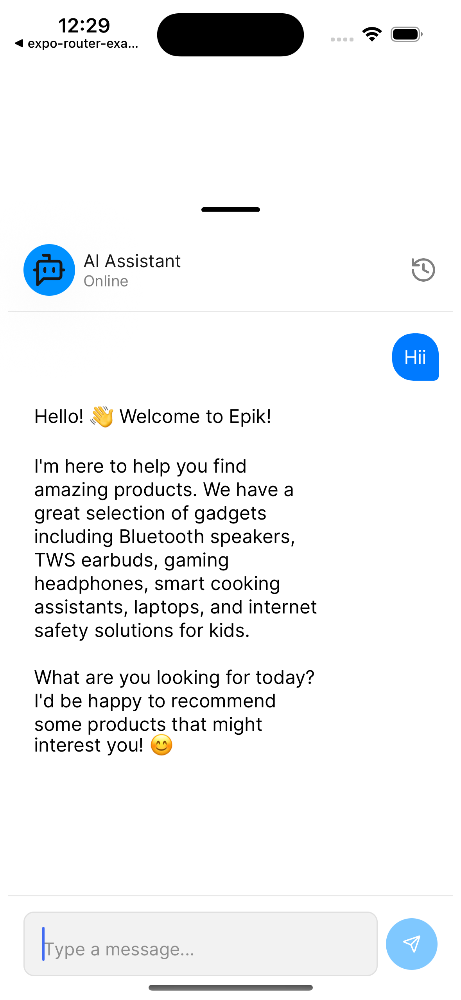
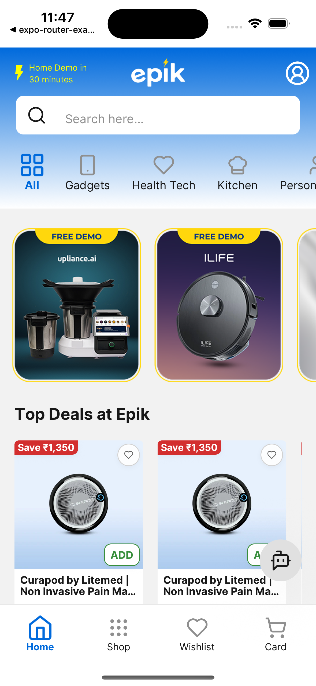
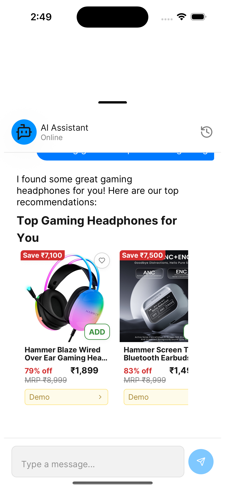

# 🚀 Cross-Platform AI-Powered App

A **cross-platform project** built with [Expo](https://expo.dev/), [expo-router](https://expo.github.io/router/), and [Tamagui](https://tamagui.dev/).
This project shares **90%+ of the codebase** across iOS, Android, and Web — reducing development time and enabling **faster feature sync** across platforms.

Integrated with an **AI Chat Feature** that provides personalized product recommendations and **generative UI experiences** for the best user journey.

---

## ✨ Features

* **📱 Cross-Platform**: Runs seamlessly on **iOS, Android, and Web** from a single codebase.
* **🎨 Responsive Design**: Beautiful, responsive UI powered by **Tamagui**.
* **🤖 AI Chat Bot**: Provides **product recommendations** based on user prompts with **generative UI**.
* **⚡ Optimized for Web**: Tamagui design system + web bundler optimizations for **faster web performance**.
* **🎞️ Cross-Platform Animations**: Smooth, consistent animations built with **Moti**.

---

## 📂 Tech Stack

* [Expo](https://expo.dev/) – Universal React Native apps
* [expo-router](https://expo.github.io/router/) – File-based routing
* [Tamagui](https://tamagui.dev/) – Cross-platform design system & styling
* [Moti](https://moti.fyi/) – Animations
* AI/LLM Integration – Generative chat and recommendations

---

## 🚦 Getting Started

```bash
# 1. Clone the repository
https://github.com/KartikDevarde2601/getepik.git

# 2. Navigate to the project
cd getepik

# 3. Install dependencies
yarn install

# 4. Run the app
touch .env.local

# 5. update .env (openrouter API key)
EXPO_PUBLIC_OPENROUTER_API_KEY=sk-or-v1-**************

```


Run on:

* **iOS**: `yarn run ios`
* **Android**: `yarn run android`
* **Web**: `yarn run web`

---

## 📸 Screenshots (Optional)

### 📱 iPhone Screens

<p float="left">
  
  
  
</p>


### Chat Bot Vidoe
## 🎥 Demo Video

[](https://youtu.be/XLuyZ8GgMwc)

---

## 📜 License

This project is licensed under the **MIT License** – feel free to use and modify.

---

## 🙌 Contributing

Contributions are welcome!
Open an issue or submit a PR if you’d like to improve the project.
